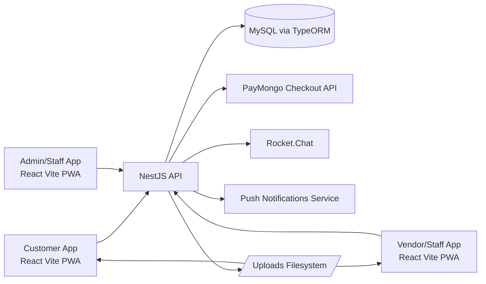
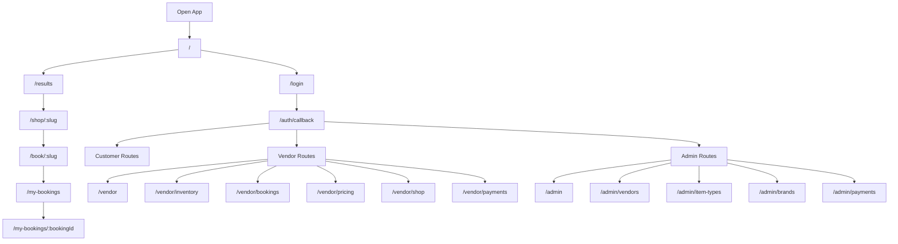
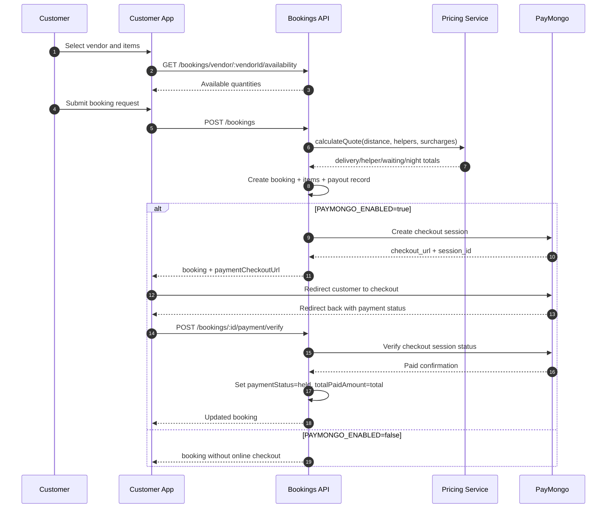
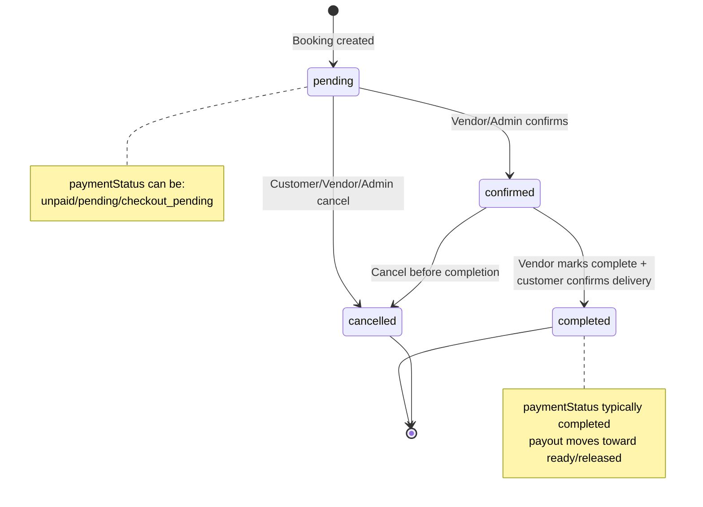
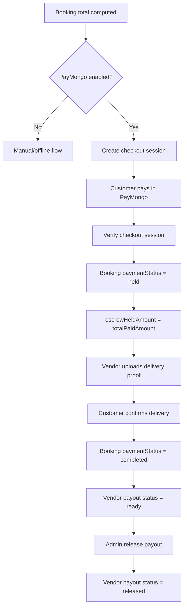
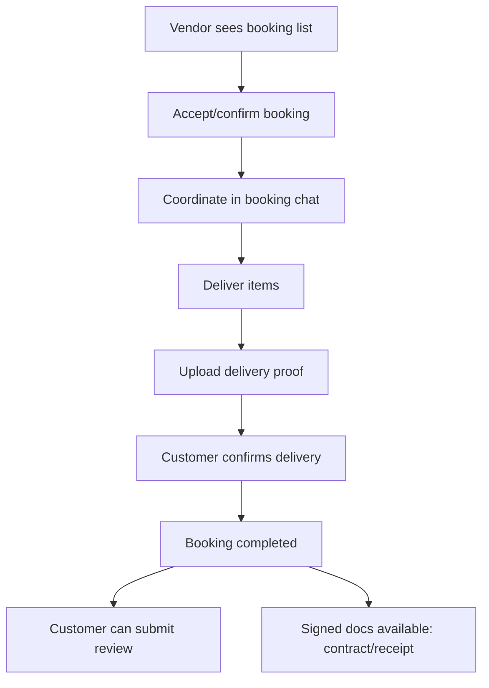
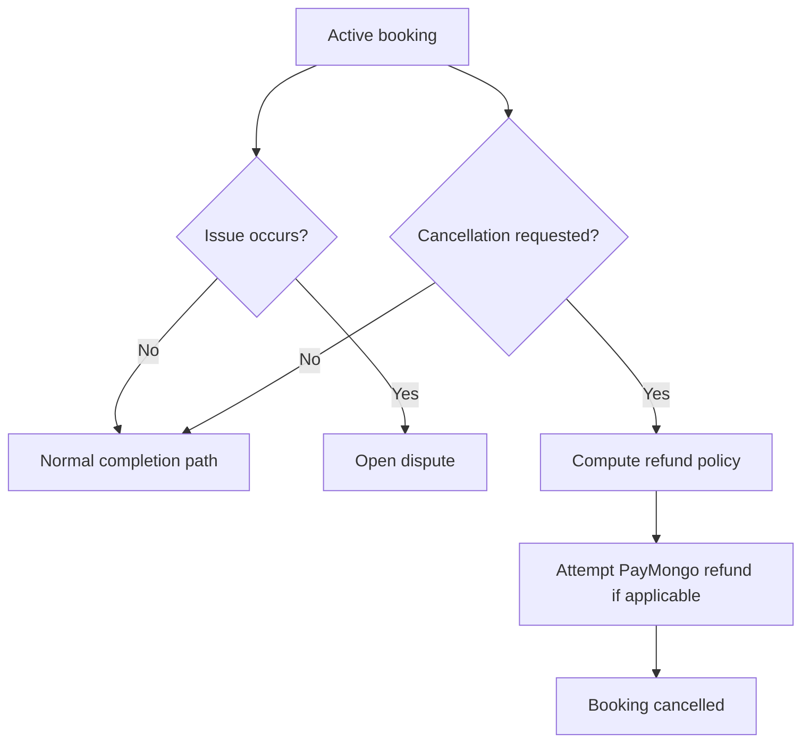

# RentalBasic Process Diagram

This document maps the current end-to-end app flow based on inspected code in frontend routes and backend booking/payment services.

## 1) System Context

## 2) Frontend Route-Level Process Map

## 3) Customer Booking + Payment Flow

## 4) Booking Lifecycle State Machine

## 5) Payment and Payout Process

## 6) Vendor Fulfillment + Post-Booking Process

## 7) Dispute and Cancellation Branches

## Notes

- Remaining-balance checkout endpoint exists but currently returns a validation error because full payment at booking checkout is enforced.
- PayMongo success/cancel redirects include booking context and return to booking screens where verification is processed.
- Route and module scopes are role-protected (customer, vendor, admin).
