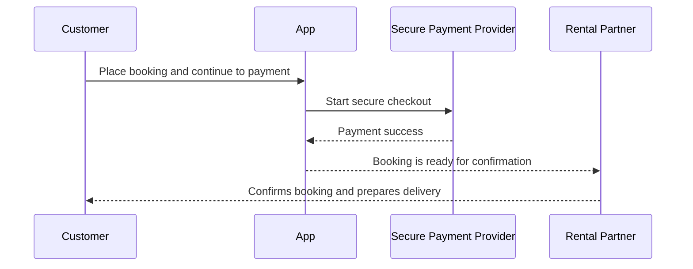

# How Payments Work

This page explains payment behavior at a business level.

## Payment Options

Rental partners can choose between:
- Full payment
- Downpayment with later balance payment

## Typical Customer Payment Journey

## Important Notes

- Customer funds remain protected until delivery is confirmed.
- Payment progress is visible in booking status.
- If downpayment is enabled, the remaining balance must be completed before delivery.
