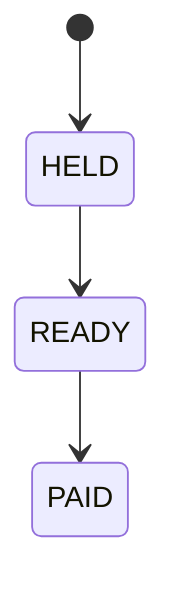

# Rental Partner Payouts

This page explains when rental partner earnings are released.

## Payout Lifecycle

## What Each Status Means

| Status | Meaning |
|---|---|
| HELD | Funds are secured and waiting for release eligibility |
| READY | Payout can be released |
| PAID | Payout has been released |

## New Rental Partner Hold

For platform safety, early rental partner orders may have a short hold period before release.
